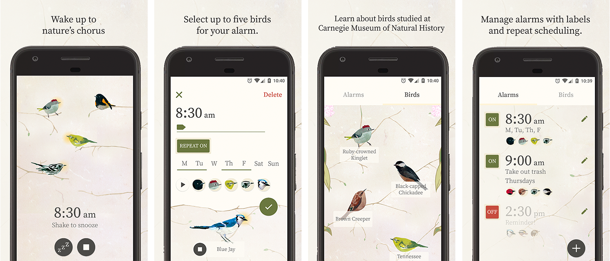

# Dawn Chorus 



Version 2 of Dawn Chorus no longer uses notifications to sound an alarm! <br>
Due to API limitations on iOS, it is only available for devices running Android (5.0 or greater).

See the [v1 branch](https://github.com/CMP-Studio/DawnChorus/tree/v1) for the previous iOS and Android versions.

### Description

Wake up to nature’s chorus with a bird alarm clock developed by Carnegie Museum of Natural History and Innovation Studio. This artfully designed app is a calming, nature-inspired alternative to your usual blaring alarm. When the alarm goes off, birds create a chorus of song. Choose from 20 birds to create a custom alarm. All of the birds are native to the northeastern United States, and users can hear their calls and learn more about them on bird cards developed with museum scientists.

### Collaborators

Carnegie Museum of Natural History is located in Pittsburgh, Pennsylvania and is one of the four Carnegie Museums of Pittsburgh. The museum is an active research institution with an environmental research center in Rector, Pennsylvania called Powdermill Nature Reserve. The birds in this app were studied at the museum, are often banded at Powdermill, or are frequently impacted by window collisions—a phenomenon that the museum helps study and prevent as part of BirdSafe Pittsburgh.

Innovation Studio is the design, development, and workflow laboratory at Carnegie Museums of Pittsburgh, where it supports a culture of innovation throughout the museums.
[Learn more about the app on the Studio blog.](https://studio.carnegiemuseums.org/dawn-chorus-ec5d2a25df7a)

### Building and Running

1\. Install all React Native dependencies  
[React Native getting started guide](https://facebook.github.io/react-native/docs/getting-started.html)

2\. Install project dependencies  
```
npm i
```  

3a\. Run on the iOS simulator  
```
react-native run-ios
```

3b\. or Android emulator  
```
react-native run-android
```

### Alarm Module

To set and recieve alarms, we handle events and data from the Android native module [react-native-android-alarms](https://github.com/CMP-Studio/react-native-android-alarms). <br> Visit that repo for more information on integration.

### Intellectual Property

All files that are the intellectual property owned by our collaborators have been removed from this repo and replaced with placeholders. This includes all the images and audio files included in the App Bundle.
